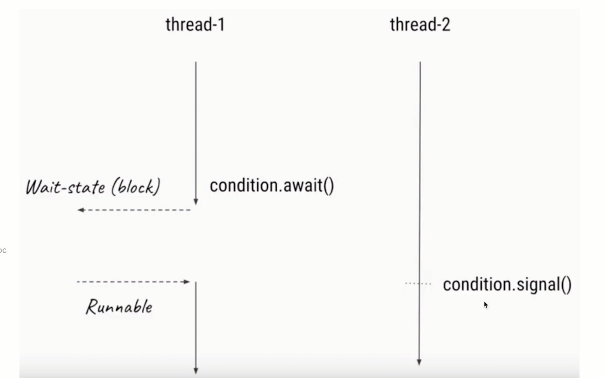

# Condition作用
当线程1需要等待某个条件的时候,它就去执行
condition.await()方法,一旦执行了await()方法,线程就会进
入阻塞状态

然后通常会有另外一个线程, 假设是线程2，去执行对应的条
件,直到这个条件达成的时候,线程2就会去执行
condition.signal()方法,这时JVM就会从被阻塞的线程里找,
找到那些等待该condition的线程,当线程1就会收到可执行信
号的时候,它的线程状态就会变成Runnable可执行状态

------

##  signalAll()和signal()区别
◆signalAlI()会唤起所有的正在等待的线程
◆但是signal()是公平的,只会唤起那个等待时间最长的线程
