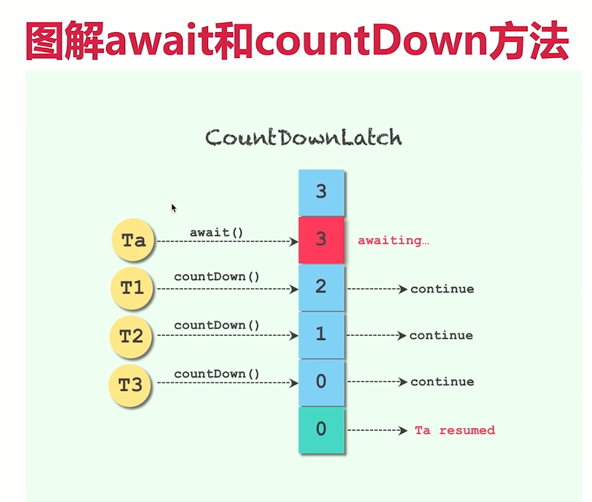

CountDownLatch类的作用
并发流程控制的工具
**可以用于一等多，同时也可以用于多等一**

◆倒数门闩
◆例子:购物拼团;大巴(游乐园坐过山车排队) , 人满发车。
流程:倒数结束之前,一-直处于等待状态，直到倒计时结束了，
此线程才继续工作。

java1.5引入

开始->进入等待->倒数结束->继续工作

## 主要方法介绍
- ◆CountDownLatch(int count) :仅有一个构造函数,参数count
为需要倒数的数值。
- ◆await() :调用await()方法的线程会被挂起,它会等待直到count
值为0才继续执行。
- ◆countDown() :将count值减1 ,直到为0时,等待的线程会被唤
起。

用法一：一个线程等待多个线程都执行完毕,再继续自己的工作。

用法二：多个线程等待某一个线程的信号 ,同时开始执行。

扩展用法：多个线程完成执行之后，再同时执行
>多个线程调用countDown,同时有多个线程调用await
>

CountDownLatch是不能够重用的,如果需要重新计数,可以考虑
 使用CyclicBarrier或者创建新的CountDownLatch实例。

**小结**
两个典型用法: -等多和多等一
CountDownLatch类在创建实例的时候,需要传递倒数次数。倒数到0的时候,之前等待的线程会继续运行
