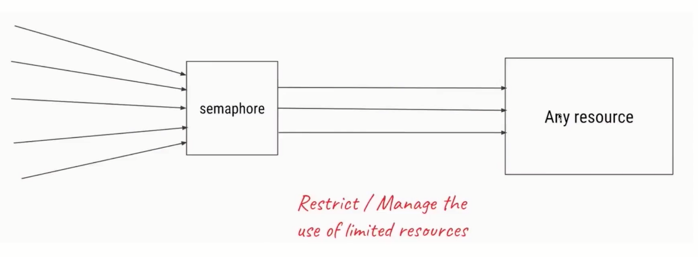
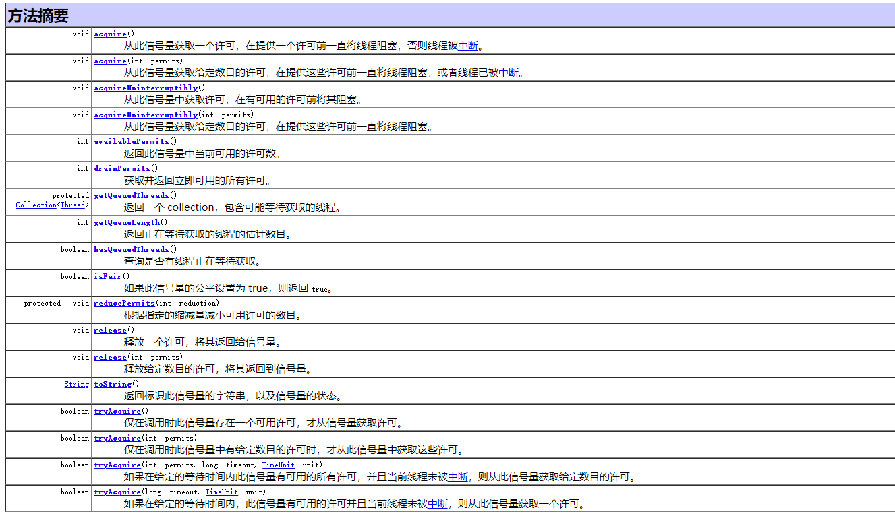

# Semaphore信号量
>Semaphore可以用来限制或管理数量有限的资源的使用情况。

**信号量使用流程**

1.初始化Semaphore并指定许可证的数量

2.在需要被现在的代码前加acquire()或者
acquireUninterruptibly(方法

3.在任务执行结束，调用release()来释放许可证

**主要方法**

- new Semaphore(int permits, boolean fair) :这里可以设置
是否要使用公平策略,如果传入true ,那么Semaphore会把
之前等待的线程放到FIFO的队列里，以便于当有了新的许可证
可以分发给之前等了最长时间的线程。

- tryAcquire() :看看现在有没有空闲的许可证,如果有的话就
获取,如果没有的话也没关系,我不必陷入阻塞,我可以去做
别的事,过一会再来查看许可证的空闲情况。

**信号量的特殊用法**
◆一次性获取或释放多个许可证
比如TaskA会调用很消耗资源的method1() ,而TaskB调用
的是不太消耗资源的method2() ,假设我们一共有5个许可
证。那么我们就可以要求TaskA获取5个许可证才能执行
而TaskB只需要获取到一个许可证就能执行,这样就避免
了A和B同时运行的情况,我们可以根据自己的需求合理分
配资源。

**注意点**
1.获取和释放的许可证数量必须一致,否则比如每次都获
取2个但是只释放1个甚至不释放,随着时间的推移,到最后许可
证数量不够用,会导致程序卡死。( 虽然信号量类并不对是否和
获取的数量做规定,但是这是我们的编程规范,否则容易出错)

2.注意在初始化Semaphore的时候设置公平性, - -般设置
为true会更合理.

3.并不是必须由获取许可证的线程释放那个许可证,事实
上，获取和释放许可证对线程并无要求,也许是A获取了,然后
由B释放,只要逻辑合理即可。（多个线程，多个线程池共享一个信号量）

4.信号量的作用,除了控制临界区最多同时有N个线程访问
外,另一个作用是可以实现"条件等待”, 例如线程1需要在线
程2完成准备工作后才能开始工作,那么就线程1 acquire() ,而线
程2完成任务后release() ,这样的话,相当于是轻量级的
CountDownLatch。
